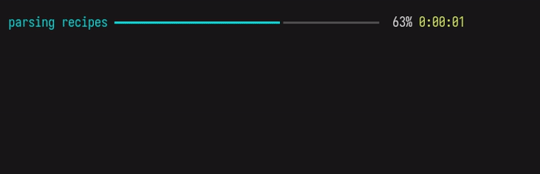

# bakar

[](https://github.com/jetm/bakar/actions/workflows/ci.yml)
[](https://pypi.org/project/bakar/)
[](https://pypi.org/project/bakar/)
[](LICENSE)
[](https://codecov.io/gh/jetm/bakar)

kas-based BSP build orchestrator for Yocto. Wraps `kas-container` with manifest-driven sync, pre-flight checks, structured telemetry, and post-mortem tooling. Works with NXP i.MX (repo XML), TI Sitara (oe-layertool), bitbake-setup workspaces, and any bring-your-own kas YAML.



## Features

- **Multi-BSP, out of the box** - NXP i.MX (`repo` XML), TI Sitara (oe-layertool), bitbake-setup workspaces, meta-avocado, and any bring-your-own kas YAML, with automatic family detection. See [docs/workspace.md](docs/workspace.md).
- **Idempotent build pipeline** - `doctor` -> `sync` -> `gen-kas` -> `kas-container` build in one command, with dry-run, `--dry-run-script` (emit a runnable shell script for the full invocation), keep-going, and from-scratch rebuild. See [docs/build.md](docs/build.md), [docs/sync.md](docs/sync.md), [docs/gen-kas.md](docs/gen-kas.md).
- **Pre-flight diagnostics** - ~30 host/container/workspace checks with PASS/WARN/BLOCK gating and PSI throttle calibration. See [docs/doctor.md](docs/doctor.md).
- **Live build UI** - a phase-aware Rich display: a parse-progress bar, then a per-task table showing every recipe building in parallel with task-type icons, an ETA, and stuck-task highlighting (a recipe running far longer than its peers turns red). Assumes a truecolor terminal and a Nerd Font.
- **Observability and post-mortem** - per-run telemetry (`events.jsonl`, logs, timing, disk usage), log tail, failure triage, and success reports. See [docs/triage.md](docs/triage.md), [docs/report.md](docs/report.md), [docs/log.md](docs/log.md).
- **Reproducibility** - pin floating layer SHAs, diff manifests/configs, detect workspace drift (`bakar drift`), generate release notes between pinned states (`bakar changelog`), flatten the resolved kas YAML, pre-fetch sources for offline builds, and seed a host-side premirror `git2_*.tar.gz` tarball from a git URL. See [docs/lock.md](docs/lock.md), [docs/diff.md](docs/diff.md), [docs/drift.md](docs/drift.md), [docs/changelog.md](docs/changelog.md), [docs/dump.md](docs/dump.md), [docs/prefetch.md](docs/prefetch.md), [docs/mirror.md](docs/mirror.md).
- **Recipe operations** - run one recipe or task through `bakar bitbake` (logged, exit-code-faithful), clean a single recipe's sstate with `bakar clean-recipe`, and analyze a recipe's dependency graph (blast radius, longest chain, cycles) with `bakar graph`. See [docs/bitbake.md](docs/bitbake.md), [docs/graph.md](docs/graph.md).
- **Build performance and robustness** - ccache (per-workspace or shared), NPROC-scaled parallelism, PSI throttling, curated mirrors, persistent hash-equivalence server, and age-based sstate/ccache pruning. See [docs/hashserv.md](docs/hashserv.md), [docs/clean-cache.md](docs/clean-cache.md).
- **Shell and scripting** - interactive/one-shot kas-container shell, run a command in every source repo, boot a QEMU image from the build dir. See [docs/shell.md](docs/shell.md), [docs/for-all.md](docs/for-all.md), [docs/run.md](docs/run.md).
- **Named presets** - name a full build configuration in `config.toml` and invoke it with `bakar build --preset <name>`; multi-release presets fan out to N sequential builds with a summary table. Manage presets with `bakar presets list/show/add/remove`. See [docs/presets.md](docs/presets.md).
- **Layered configuration** - CLI > `BAKAR_*` env > workspace `.bakar.toml` > preset > user `config.toml` > BSP default, plus a `settings` CRUD interface and a vendor config layer for custom board families. See [docs/settings.md](docs/settings.md), [docs/configuration.md](docs/configuration.md).
- **Advanced tooling** - swap the BSP-bundled bitbake for a local upstream checkout, and stress-test the bitbake parser fork race. See [docs/bitbake-override.md](docs/bitbake-override.md), [docs/stress-parse.md](docs/stress-parse.md).
- **Workspace scaffolding** - `init` wizard (interactive or `--family`) writes `.bakar.toml`. See [docs/init.md](docs/init.md).
- **Read-only inspection** - query any BitBake variable (`getvar`), dump resolved build metadata (`show`), inspect layer stack and override precedence (`layers inspect`/`status`), compare task signatures across builds (`diffsigs`), and walk the full recipe environment (`inspect`). See [docs/getvar.md](docs/getvar.md), [docs/show.md](docs/show.md), [docs/layers.md](docs/layers.md), [docs/inspect.md](docs/inspect.md), [docs/diffsigs.md](docs/diffsigs.md).

## Install

```bash
uv tool install git+https://github.com/jetm/bakar.git
```

## Quickstart

```bash
# NXP i.MX manifest-driven build
bakar build -f imx-6.12.49-2.2.0.xml -m imx8mp-var-dart

# Bring-your-own kas YAML
bakar build my-project.yml

# Post-mortem a failed build
bakar triage
```

## Documentation

Full command reference, workflow guides, and configuration: **[docs/index.md](docs/index.md)**
